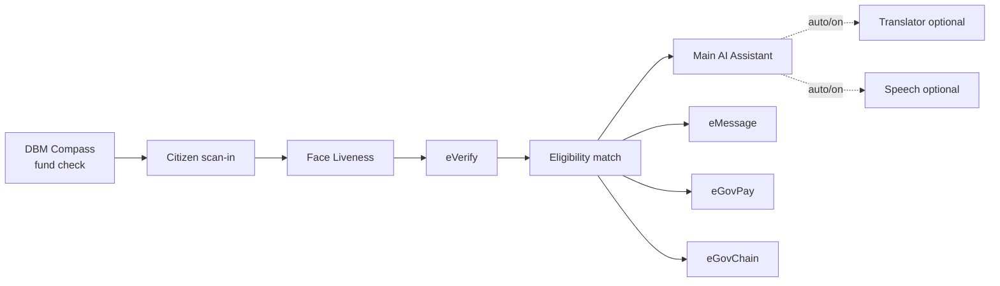
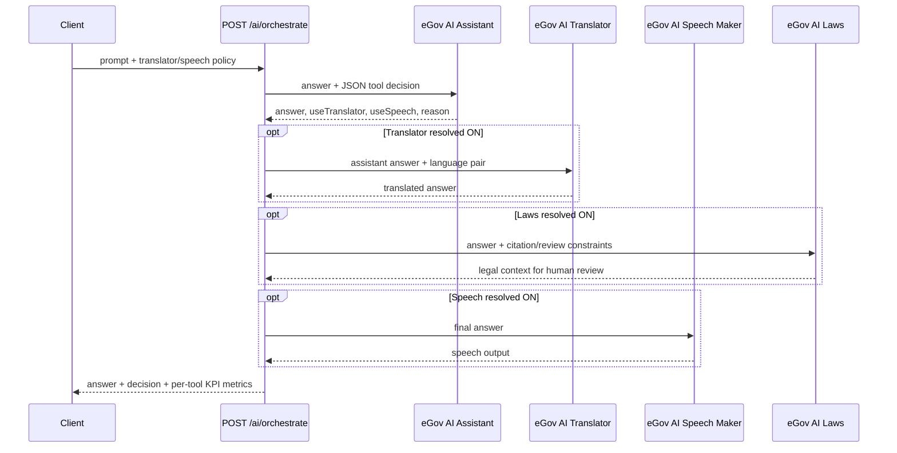
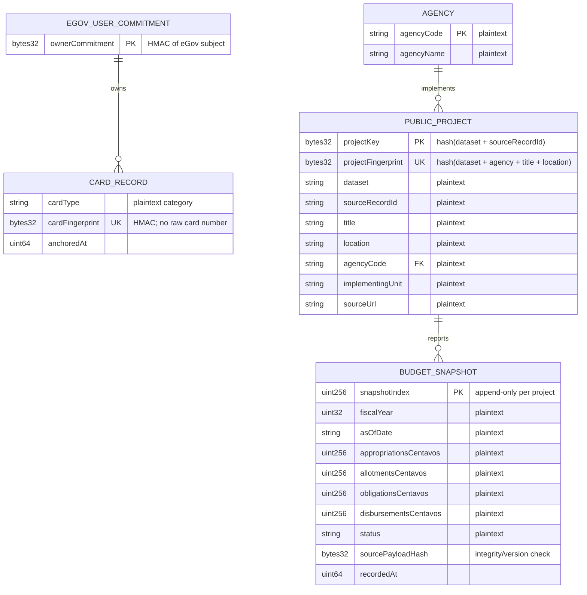
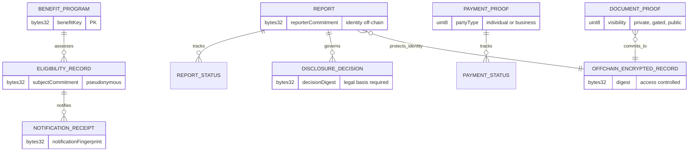
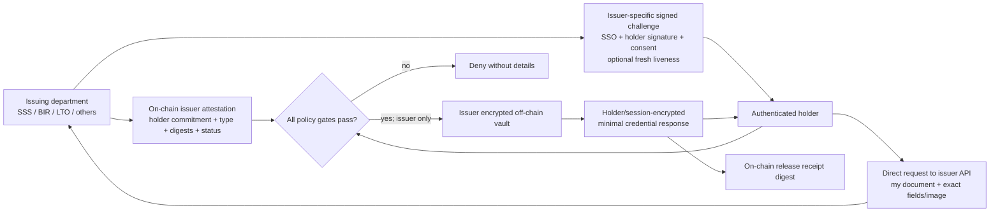
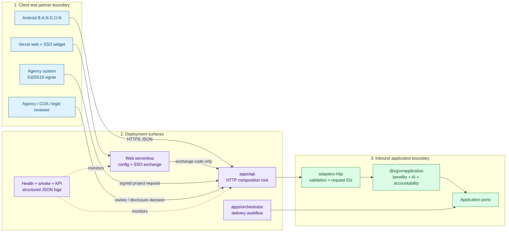
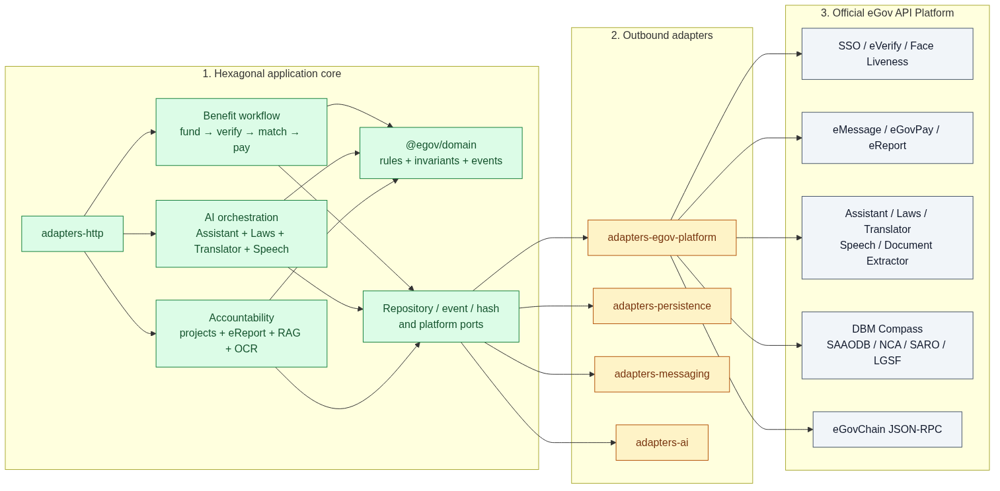
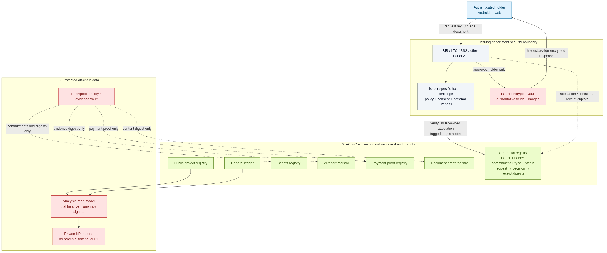

<h1 align="center">B.A.N.G.O.N</h1>

<p align="center">
  <strong>Benefit Allocation &amp; Navigation for Government Opportunities Nationwide</strong>
</p>

<p align="center">
  Proactive Philippine benefit-matching on the official eGov API Platform —
  fund-check first, verify the citizen, match eligibility, notify, and disburse
  without agency-by-agency applications.
</p>

<p align="center">
  <a href="https://egov-hackathon.vercel.app"><strong>Live Website</strong></a>
  ·
  <a href="docs/architecture.md"><strong>Architecture</strong></a>
  ·
  <a href="docs/api-android.md"><strong>Android API</strong></a>
  ·
  <a href="eGov_PH_SuperApp_System_Architecture.md"><strong>Pitch Spec</strong></a>
  ·
  <a href="docs/platform-apis.md"><strong>Platform APIs</strong></a>
  ·
  <a href="docs/integration-openapi.yaml"><strong>OpenAPI</strong></a>
  ·
  <a href="docs/test-results.md"><strong>Test Results</strong></a>
  ·
  <a href="https://platforms.e.gov.ph/dashboard"><strong>eGov Dashboard</strong></a>
</p>

<p align="center">
  
  
  
  
  
  
</p>

---

## About and Important Links

B.A.N.G.O.N is an Android-first government-benefit coordination prototype with a Vercel-hosted eGovPH SSO test surface, server-side integrations for all nine hackathon platform services, privacy-preserving citizen card anchoring, and a plaintext public-project transparency ledger.

| Resource | Link |
|---|---|
| Live eGovPH SSO staging website | [egov-hackathon.vercel.app](https://egov-hackathon.vercel.app) |
| Source repository | [github.com/TadeyRuk/eGov](https://github.com/TadeyRuk/eGov) |
| eGov platform dashboard | [platforms.e.gov.ph/dashboard](https://platforms.e.gov.ph/dashboard) |
| eGovChain explorer | [hackathon-explorer.e.gov.ph](https://hackathon-explorer.e.gov.ph) |
| Integration OpenAPI | [docs/integration-openapi.yaml](docs/integration-openapi.yaml) |
| Verified KPI and transaction results | [docs/test-results.md](docs/test-results.md) |
| Blockchain normalization/privacy rules | [docs/tolvaris-ledgers.md](docs/tolvaris-ledgers.md) |
| Accountability, analytics, news RAG, and OCR | [docs/accountability-and-analytics.md](docs/accountability-and-analytics.md) |
| Government credential/document exchange | [docs/credential-exchange.md](docs/credential-exchange.md) |
| Weekly graft/corruption RAG pipeline | [docs/weekly-accountability-rag.md](docs/weekly-accountability-rag.md) |
| Synthetic transparency dashboard | [egov-hackathon.vercel.app/transparency.html](https://egov-hackathon.vercel.app/transparency.html) |

The public website intentionally remains in **STAGING** mode: the official widget stays visible for integration demonstration and displays a warning that production citizen accounts may not work there.

## Why B.A.N.G.O.N

Citizens should not discover benefits by walking agency to agency. B.A.N.G.O.N flips the model:

1. Check which programs are **actually funded** (DBM Compass) — before promising anything.
2. Verify the person is live and matches PhilSys (Face Liveness + eVerify).
3. Match only against that **fundable** list using PSA-grounded eligibility fields.
4. Notify via eMessage, disburse financial benefits via eGovPay, and anchor on eGovChain.
5. Explain decisions in plain language with eGov AI; escalate non-delivery via eReport.

Fund-checking runs **before** matching so a citizen is never told they qualify for an unfunded program.

## How It Works



| Step | Platform / code | Role |
|------|-----------------|------|
| Fund check | `DbmCompassPort` | Which benefits have budget right now |
| Liveness | `FaceLivenessPort` | Live person (`SUCCEEDED` + confidence ≥ 95) |
| Identity | `EVerifyPort` | PSA fields → `CitizenEligibilityProfile` |
| Match | `findEligibleBenefits` | Pure rules over fundable catalog only |
| Notify | `notifyEligibility` → categorized eMessage policy | Announcement, qualification, requirements, status, or reminder; no links/OTPs; duplicate, cooldown, and daily-limit suppression |
| Disburse | `disburseBenefit` → eGovPay | Financial benefits only |
| Anchor | `anchorBenefitMatch` → eGovChain | Tamper-evident hash of match |
| Explain | `explainEligibility` → eGov AI | Plain-language help (post-decision) |
| AI tool routing | `orchestrateEgovAi` | Assistant decides whether Laws/Translator/Speech is needed; each can be `auto`, `on`, or `off` |
| Escalate | `reportBenefitNonDelivery` → eReport | Citizen-initiated non-delivery |

Seed catalog (hackathon stub — no live agency benefit API among the 9 services): SSS senior pension, PhilHealth senior subsidy, DSWD widowed assistance.

## What Is Built vs Not

| Area | Status |
|------|--------|
| Domain: `Benefit`, `EligibilityRule`, `BenefitMatch`, `isEligibleForBenefit` | Built |
| Use cases in `packages/application/src/use-cases/bangon.ts` | Built (composable, not one monolith) |
| `BenefitCatalogPort` + in-memory seed catalog | Built |
| All 9 eGov platform ports/adapters | Built (env-backed `fetch`) |
| `apps/api` B.A.N.G.O.N + case HTTP routes | Built |
| Face gate inside `confirmCitizenIdentity` | Built (`isFaceLivenessPassed`) |
| eGovChain / eGov AI / eReport B.A.N.G.O.N use cases | Built (`anchorBenefitMatch`, `explainEligibility`, `reportBenefitNonDelivery`) |
| Android B.A.N.G.O.N citizen client | Not yet (Phase 4 — primary UI) |
| Java eGovPH SSO test APK (`apps/android-sso-java`) | Built as a separate standalone client |
| Tolvaris on-chain card-type registry | Built; pseudonymous owner commitment + plaintext card type + card fingerprint |
| Tolvaris public DBM project registry | Built; normalized plaintext agency/project/snapshot records + duplicate indexes |
| Agency-signed project publishing API | Built; Ed25519 public-key verification, nonce/timestamp replay protection, agency binding |
| AI Assistant tool orchestration | Built; optional Laws/Translator/Speech, degraded fallback, per-tool KPI metrics |
| Laws tool orchestration | Built; `auto/on/off`, citations requested, anomalies remain human-review signals |
| Structured API logging and KPI reports | Built; request ID, status, latency, safe error type, local JSON reports |
| Double-entry analytics | Built; 3 synthetic agencies/projects, 6 balanced entries, accounting equation, deterministic review signals |
| Benefits + eMessage audit trail | Built; normalized program/eligibility/notification registry with pseudonymous citizen commitments |
| eReport accountability | Built; encrypted off-chain identity boundary, public commitments/status/disclosure decisions |
| eGovPay proof registry | Built; private individual commitments and policy-gated plaintext business mode |
| Public-interest news RAG | Built as an application use case; retrieved-source allowlist and `UNVERIFIED_MEDIA_SIGNAL` guardrail |
| Weekly accountability RAG automation | Built; keyword-scoped retrieval → eGov AI normalized JSON → review-gated eReport drafts → optional on-chain unverified signal digests |
| Government-document OCR | Built as an application use case; strict normalization and public/private document-proof modes |
| Credential/document self-service gate | Built as a deterministic issuer/holder policy evaluator plus on-chain attestation/request/decision/release schema; external department connectors remain approval-dependent |
| Multi-agency PSA cascade / barangay rollout | Vision only |

Ground truth: [docs/architecture.md](docs/architecture.md) · [Tolvaris ledger model](docs/tolvaris-ledgers.md) · [Verified test results](docs/test-results.md) · Product Vision · B.A.N.G.O.N.

Latest showcase verification (2026-07-22): the Tolvaris DBM Compass duplicate-detection KPI passed **7/7 checks**. Exact-key lookup p95 was **206.69 ms** and contextual-fingerprint lookup p95 was **207.76 ms** across the documented 15-iteration showcase run, against a 2,000 ms target. The current automated-test total is updated in [docs/test-results.md](docs/test-results.md) after every full verification run.

## Complete Implementation Inventory

| Capability | Implementation | Health/KPI evidence |
|---|---|---|
| eGov SSO | Server-side exchange/profile, Vercel widget, Java WebView APK; secrets never enter browser/APK | Live config, validation route, Chrome widget mount |
| eVerify | Token authentication and Tier personal-information query contracts | Safe platform smoke + unit response-shape tests |
| Face Liveness | Create session, localhost/device camera redirect, poll result; pass only at `SUCCEEDED` and ≥95 confidence | Live write smoke when explicitly enabled |
| eMessage | Categorized SMS adapter with server-side token, dedupe/cooldown/daily cap | Live push verified with an explicit designated number; routine smoke remains read-only |
| eGov AI | Assistant, Speech, Tourism, Laws, Translator, Document Extractor, Credits | Tool-level response times and credit-aware live AI KPI |
| AI tool calling | Main Assistant returns a structured tool plan; Laws/Translator/Speech resolve through `auto/on/off` policies | Five orchestration behavior tests + live KPI |
| eGovPay | Generate, transaction detail, and void; correct HMAC behavior strips leading test-mode prefix for digest key | Unit tests + safe unknown-transaction probe |
| eGovChain | Generic JSON-RPC, card registry, public-project registry, deployment/read-back tooling | Chain ID, exact lookup, write/read transactions, latency KPI |
| eReport | Token, datasets, complaint, OTP verification, list/view report | Safe token + report-types smoke |
| DBM Compass | SAAODB/NCA/SARO/LGSF records and dashboards | Safe GET smoke + Tolvaris duplicate/read-back KPI |
| Citizen card ledger | HMAC owner/card commitments; readable card type only | Synthetic `NATIONAL_ID` write/read test |
| Public transparency ledger | Plaintext Agency → Project → BudgetSnapshot, append-only reporting | Synthetic LGSF project/snapshot + 7/7 duplicate KPI |
| Signed partner API | `POST /tolvaris/projects`, Ed25519 signature, key/agency allowlist, timestamp and nonce | Valid/tampered/stale signature tests; publish response timings |
| Android | Existing Kotlin B.A.N.G.O.N scaffold plus standalone Java SSO test APK | Gradle build + APK secret scan |
| Web | Self-contained `apps/web` deployed with Vercel Root Directory `apps/web` | Live stable alias and Chrome CDP DOM checks |

## AI Assistant Tool Calling

`POST /ai/orchestrate` is the main AI caller. It mints one temporary eGov AI token, asks the Assistant for a strict structured plan, then conditionally calls Translator and Speech Maker with the same token.



| Policy | Behavior |
|---|---|
| `auto` | Main Assistant decides whether the tool is useful |
| `on` | Tool is forced even when the Assistant says it is unnecessary |
| `off` | Tool cannot be called |

Translator or Speech failure produces `status: "degraded"` while retaining the main Assistant answer. Token/Main Assistant failures return a service error with the metrics completed so far. Prompts and generated contents are not written to application logs.

Example:

```bash
curl --request POST http://localhost:8787/ai/orchestrate \
  --header 'Content-Type: application/json' \
  --data '{
    "prompt": "Explain this benefit in Filipino and read it aloud.",
    "sourceLang": "en",
    "targetLang": "fil",
    "translator": "auto",
    "speech": "auto"
  }'
```

## Agency-Signed Open API

Authorized agencies publish public projects through `POST /tolvaris/projects`. The agency keeps its Ed25519 private key locally and sends only a signature. The server holds an allowlist of public keys and binds each key ID to one agency code.

```text
SHA256_BODY = sha256(exact request bytes)
MESSAGE = timestamp + "\n" + nonce + "\nPOST\n/tolvaris/projects\n" + SHA256_BODY
SIGNATURE = base64(ed25519_sign(agency_private_key, MESSAGE))
```

Required headers: `X-Agency-Key-Id`, `X-Agency-Timestamp`, `X-Agency-Nonce`, and `X-Agency-Signature`. The five-minute timestamp window and one-time nonce reduce replay risk; exact source-key and contextual fingerprint lookups reject duplicate projects before blockchain submission. The full contract is in [docs/integration-openapi.yaml](docs/integration-openapi.yaml).

Private keys, partner secrets, and API keys must never be placed in request bodies or committed configuration. Public-key allowlist format is documented in [`.env.example`](.env.example).

## Health, Logging, and KPI Reporting

Every `apps/api` response includes `X-Request-Id`. One structured JSON log is emitted when the response finishes:

```json
{"level":"info","event":"http_request","requestId":"…","method":"POST","path":"/ai/orchestrate","status":200,"durationMs":412.35}
```

AI tools additionally log `tool`, `status`, and `durationMs`; agency publication logs key ID, agency code, public project key, transaction hash, and timing. Logs deliberately exclude tokens, credentials, prompts, AI output, profile values, signed request bodies, and raw provider errors.

| Command | Coverage | Report |
|---|---|---|
| `pnpm test` | Unit/contract behavior across packages | Terminal/TAP |
| `pnpm typecheck` | All TypeScript packages and composition roots | Terminal |
| `pnpm hygiene` | Tracked secret/PII hygiene | Terminal |
| `pnpm smoke:platform` | All nine platform services; safe probes by default | `.local/reports/platform-smoke-latest.json` |
| `pnpm kpi:system` | Vercel page/config/routes, card ledger, chain, transparency lookup, optional API health | `.local/reports/system-kpi-latest.json` |
| `pnpm kpi:ai` | Live Assistant → Laws → Translator → Speech routing; may consume AI credits | `.local/reports/egov-ai-kpi-latest.json` |
| `pnpm kpi:tolvaris-transparency` | Exact/contextual duplicate detection and lookup latency | Terminal/JSON |
| `pnpm kpi:accountability` | Benefit/report/payment/document live read-back plus privacy invariants | `.local/reports/accountability-registry-kpi-latest.json` |

KPI commands return a non-zero exit code when a required check fails. `SKIP` is reported separately when a safe probe cannot prove a write-only service without explicit authorization. Use `pnpm smoke:platform -- --write` only when intentional side effects are acceptable.

## Tolvaris blockchain schema (UML/ER)



The DBM Compass side deliberately keeps public project and expenditure fields readable. Exact source-key and contextual fingerprint hashes are lookup/deduplication indexes, while the complete payload hash detects changed source versions. Citizen names, raw IDs, credentials, bank data, and incidental PII never belong in either public project records or the public chain. Detailed normalization rules are in [docs/tolvaris-ledgers.md](docs/tolvaris-ledgers.md).

The additional accountability registries use separate schemas so one disclosure rule cannot accidentally expose another domain:



See [the accountability and analytics guide](docs/accountability-and-analytics.md) for the general-ledger standards basis, anomaly rules, public-interest news RAG guardrails, OCR flow, and privacy matrix.

## Government Credential and Document Self-Service

Tolvaris generalizes the existing card-type ledger to IDs, licences, registrations, certificates, permits, tax documents, and other government credentials. The blockchain is the ground source of truth that an approved issuer attested a credential type to a pseudonymous holder, plus its active/revoked/expired state and audit digests. It is not a shared document database. The user directly requests the record from the original issuer—such as LTO, BIR, or SSS—and only that issuer may return its own details or image to the authenticated holder. The chain stores no names, credential numbers, fields, portraits, ID images, biometrics, or decryptable vault locations—even in encrypted form.



There is no technically honest “100% identity certainty.” The implementation returns `HIGH` assurance only after the issuer's policy factors pass and otherwise fails closed as `INSUFFICIENT`. BIR, LTO, SSS, and other departments may define different signed challenges, allowed fields, liveness thresholds, expiry windows, and image-release rules. A different department cannot use this path to retrieve the record. A real connector still requires the issuer's approved API contract, authenticated-holder authorization, lawful purpose, data minimization, consent rules, and audited access.

Implementation and full sequence/UML: [Government credential and document exchange](docs/credential-exchange.md) · [Solidity registry](contracts/TolvarisCredentialExchangeRegistry.sol) · [Policy evaluator](packages/application/src/use-cases/credential-access.ts).

## System Architecture

Hexagonal monorepo (repo folder / GitHub: `eGov`). Domain never imports adapters. The architecture is split into three readable PNG views; click each image for full resolution and use the source link to edit its Mermaid definition. A single [complete overview](docs/diagrams/system-architecture.png) and its [Mermaid source](docs/diagrams/system-architecture.mmd) are retained as references.

### 1. Clients and deployment runtime

[](docs/diagrams/system-architecture-1-clients-runtime.png)

[Editable Mermaid source](docs/diagrams/system-architecture-1-clients-runtime.mmd)

### 2. Hexagonal core and official eGov integrations

[](docs/diagrams/system-architecture-2-core-integrations.png)

[Editable Mermaid source](docs/diagrams/system-architecture-2-core-integrations.mmd)

### 3. Data, blockchain, and credential self-service

[](docs/diagrams/system-architecture-3-data-credentials.png)

[Editable Mermaid source](docs/diagrams/system-architecture-3-data-credentials.mmd)

| Layer | Package | Responsibility |
|-------|---------|----------------|
| Domain | `@egov/domain` | Benefit / eligibility invariants |
| Application | `@egov/application` | Ports + B.A.N.G.O.N / case / orchestration use cases |
| Adapters | `@egov/adapters-*` | Persistence, HTTP, AI, messaging, **egov-platform** |
| Apps | `apps/api`, `apps/orchestrator`, `apps/web` | API/orchestrator roots plus a self-contained Vercel SSO test site |
| Client | Android B.A.N.G.O.N | Primary citizen UI — HTTP to `apps/api` only |

## Official Platform APIs

Credentials **only** from [platforms.e.gov.ph/dashboard](https://platforms.e.gov.ph/dashboard). Never commit secrets.

| Port | Service |
|------|---------|
| `EgovSsoPort` | eGov SSO |
| `EVerifyPort` | eVerify |
| `FaceLivenessPort` | Face Liveness |
| `EMessagePort` | eMessage |
| `EgovAiPort` | eGov AI |
| `EgovPayPort` | eGovPay |
| `EgovChainPort` | eGovChain (JSON-RPC, chain `13371`) |
| `EReportPort` | eReport |
| `DbmCompassPort` | DBM Compass |

Full catalog: [docs/platform-apis.md](docs/platform-apis.md).

## Technology

| Layer | Implementation |
|-------|----------------|
| Language | TypeScript (Node 20+) |
| Workspaces | pnpm 9 monorepo |
| Architecture | Hexagonal ports & adapters |
| Platform I/O | `fetch` + `.env` secrets via `@egov/adapters-egov-platform` |
| Persistence (now) | In-memory stubs (`@egov/adapters-persistence`) |
| Delivery line | Multi-agent orchestrator (`apps/orchestrator`) |
| Hygiene / smoke | `pnpm hygiene`, `pnpm smoke:platform` |

## Repository Map

```
apps/
  api/                 # HTTP composition root (Android client target)
  android/             # Kotlin B.A.N.G.O.N scaffold
  android-sso-java/    # standalone Java eGovPH SSO test APK
  web/                 # Vercel staging SSO + card-ledger test site
  orchestrator/        # agent delivery pipeline
packages/
  domain/              # Benefit + ServiceCase invariants
  application/         # bangon.ts, service-cases, ports
  shared/
  adapters-egov-platform/
  adapters-persistence/
  adapters-http/
  adapters-ai/
  adapters-messaging/
contracts/             # Tolvaris card + public-project Solidity registries
docs/                  # architecture, OpenAPI, test results, platform/API references
tooling/               # deployment, KPI, hygiene, and benchmark scripts
eGov_PH_SuperApp_System_Architecture.md
tooling/check-hygiene.mjs
```

See also: [docs/boundaries.md](docs/boundaries.md), [docs/design.md](docs/design.md), [docs/tasks.md](docs/tasks.md), [docs/criteria.md](docs/criteria.md).

## Run Locally

### Prerequisites

- Node.js 20+
- pnpm 9.x (`npx pnpm@9.15.0` if not on PATH)
- Dashboard credentials copied into `.env`

```bash
git clone https://github.com/TadeyRuk/eGov.git
cd eGov

npx pnpm@9.15.0 install
npx pnpm@9.15.0 typecheck

cp .env.example .env   # then fill from the eGov dashboard — never commit .env

pnpm hygiene
pnpm smoke:platform    # safe probes; add -- --write for Face / SMS / Pay generate
pnpm kpi:system        # website + serverless + chain + registry health/latency
pnpm kpi:ai            # live Assistant tool routing; consumes AI credits
pnpm kpi:tolvaris-transparency
pnpm kpi:accountability

pnpm --filter @egov/api dev
pnpm --filter @egov/orchestrator dev
```

### Environment variables

See [`.env.example`](.env.example). Dashboard-shaped names are preferred (adapters accept aliases):

| Variable | Service |
|----------|---------|
| `EGOV_SSO_PARTNER_CODE` / `EGOV_SSO_PARTNER_SECRET` | SSO |
| `EVERIFY_CLIENT_ID` / `EVERIFY_CLIENT_SECRET` | eVerify |
| `FACE_LIVENESS_API_KEY` | Face Liveness |
| `EMESSAGE_AUTH_TOKEN` | eMessage |
| `EGOV_AI_ACCESS_CODE` (alias `EGOV_AI_API_KEY`) | eGov AI — mint Bearer via `/api/v1/egov/integration/token` |
| `EGOVPAY_API_KEY` (+ optional `EGOVPAY_HMAC_SECRET`, settlement UUID) | eGovPay |
| `EGOVCHAIN_RPC_URL` / `EGOVCHAIN_CHAIN_ID` | eGovChain |
| `EREPORT_ACCESS_TOKEN` | eReport |
| `DBM_COMPASS_API_KEY` | DBM Compass |
| `TOLVARIS_REGISTRY_ADDRESS` / `TOLVARIS_TRANSPARENCY_REGISTRY_ADDRESS` | Deployed card/public-project contracts |
| `EGOVCHAIN_SIGNER_PRIVATE_KEY` | Server-only Tolvaris registrar key |
| `TOLVARIS_OWNER_HMAC_SECRET` | Server-only citizen/card commitment secret |
| `TOLVARIS_AGENCY_PUBLIC_KEYS_JSON` | Agency key ID → agency code + Ed25519 public key allowlist |
| `EGOV_WEB_URL` / `EGOV_API_URL` | Optional KPI targets |

Optional smoke overrides: `SMOKE_SSO_EXCHANGE_CODE`, `SMOKE_SSO_SCOPE` (default `SSO_AUTHENTICATION`), `SMOKE_SMS_TO`, `SMOKE_PAY_TRANSACTION_ID`.

## Docs

| Doc | Role |
|-----|------|
| [docs/api-android.md](docs/api-android.md) | Frozen HTTP contract for the Android BANGON client |
| [docs/architecture.md](docs/architecture.md) | Layers, ports, B.A.N.G.O.N built vs vision |
| [eGov_PH_SuperApp_System_Architecture.md](eGov_PH_SuperApp_System_Architecture.md) | Hackathon pitch / SuperApp spec |
| [docs/platform-apis.md](docs/platform-apis.md) | Official 9-service reference |
| [docs/integration-openapi.yaml](docs/integration-openapi.yaml) | AI orchestration + signed agency publishing OpenAPI |
| [docs/tolvaris-ledgers.md](docs/tolvaris-ledgers.md) | Blockchain normalization, plaintext/privacy, duplicate hashes |
| [docs/accountability-and-analytics.md](docs/accountability-and-analytics.md) | General ledger, benefits, eReport, eGovPay proofs, news RAG, OCR, privacy |
| [docs/credential-exchange.md](docs/credential-exchange.md) | Issuer attestations and direct holder retrieval with department challenges, consent, and minimal field/image release |
| [docs/test-results.md](docs/test-results.md) | Verified tests, latency KPIs, and transaction evidence |
| [docs/tasks.md](docs/tasks.md) | Backlog foundation → production |
| [docs/hackathon-mechanics.md](docs/hackathon-mechanics.md) | Judging mechanics |
