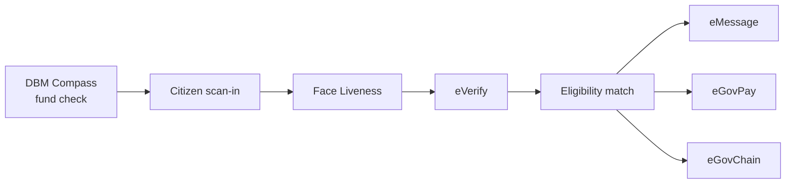
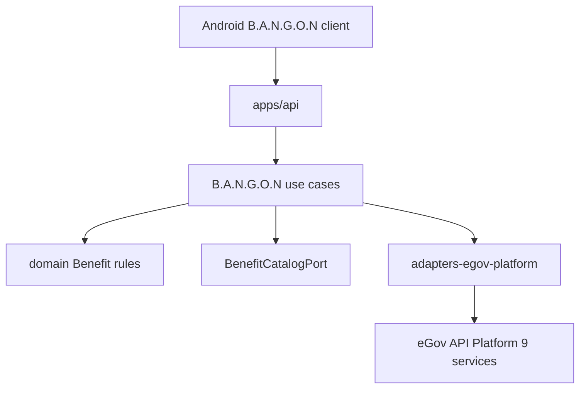

<h1 align="center">B.A.N.G.O.N</h1>

<p align="center">
  <strong>Benefit Allocation &amp; Navigation for Government Opportunities Nationwide</strong>
</p>

<p align="center">
  Proactive Philippine benefit-matching on the official eGov API Platform —
  fund-check first, verify the citizen, match eligibility, notify, and disburse
  without agency-by-agency applications.
</p>

<p align="center">
  <a href="docs/architecture.md"><strong>Architecture</strong></a>
  ·
  <a href="docs/api-android.md"><strong>Android API</strong></a>
  ·
  <a href="eGov_PH_SuperApp_System_Architecture.md"><strong>Pitch Spec</strong></a>
  ·
  <a href="docs/platform-apis.md"><strong>Platform APIs</strong></a>
  ·
  <a href="https://platforms.e.gov.ph/dashboard"><strong>eGov Dashboard</strong></a>
</p>

<p align="center">
  
  
  
  
  
  
</p>

---

## Why B.A.N.G.O.N

Citizens should not discover benefits by walking agency to agency. B.A.N.G.O.N flips the model:

1. Check which programs are **actually funded** (DBM Compass) — before promising anything.
2. Verify the person is live and matches PhilSys (Face Liveness + eVerify).
3. Match only against that **fundable** list using PSA-grounded eligibility fields.
4. Notify via eMessage, disburse financial benefits via eGovPay, and anchor on eGovChain.
5. Explain decisions in plain language with eGov AI; escalate non-delivery via eReport.

Fund-checking runs **before** matching so a citizen is never told they qualify for an unfunded program.

## How It Works



| Step | Platform / code | Role |
|------|-----------------|------|
| Fund check | `DbmCompassPort` | Which benefits have budget right now |
| Liveness | `FaceLivenessPort` | Live person (`SUCCEEDED` + confidence ≥ 95) |
| Identity | `EVerifyPort` | PSA fields → `CitizenEligibilityProfile` |
| Match | `findEligibleBenefits` | Pure rules over fundable catalog only |
| Notify | `notifyEligibility` → eMessage | SMS with no links / no OTPs |
| Disburse | `disburseBenefit` → eGovPay | Financial benefits only |
| Anchor | `anchorBenefitMatch` → eGovChain | Tamper-evident hash of match |
| Explain | `explainEligibility` → eGov AI | Plain-language help (post-decision) |
| Escalate | `reportBenefitNonDelivery` → eReport | Citizen-initiated non-delivery |

Seed catalog (hackathon stub — no live agency benefit API among the 9 services): SSS senior pension, PhilHealth senior subsidy, DSWD widowed assistance.

## What Is Built vs Not

| Area | Status |
|------|--------|
| Domain: `Benefit`, `EligibilityRule`, `BenefitMatch`, `isEligibleForBenefit` | Built |
| Use cases in `packages/application/src/use-cases/bangon.ts` | Built (composable, not one monolith) |
| `BenefitCatalogPort` + in-memory seed catalog | Built |
| All 9 eGov platform ports/adapters | Built (env-backed `fetch`) |
| `apps/api` B.A.N.G.O.N + case HTTP routes | Built |
| Face gate inside `confirmCitizenIdentity` | Built (`isFaceLivenessPassed`) |
| eGovChain / eGov AI / eReport B.A.N.G.O.N use cases | Built (`anchorBenefitMatch`, `explainEligibility`, `reportBenefitNonDelivery`) |
| Android B.A.N.G.O.N citizen client | Not yet (Phase 4 — primary UI) |
| Multi-agency PSA cascade / barangay rollout | Vision only |

Ground truth: [docs/architecture.md](docs/architecture.md) · Product Vision · B.A.N.G.O.N.

## System Architecture

Hexagonal monorepo (repo folder / GitHub: `eGov`). Domain never imports adapters.



| Layer | Package | Responsibility |
|-------|---------|----------------|
| Domain | `@egov/domain` | Benefit / eligibility invariants |
| Application | `@egov/application` | Ports + B.A.N.G.O.N / case / orchestration use cases |
| Adapters | `@egov/adapters-*` | Persistence, HTTP, AI, messaging, **egov-platform** |
| Apps | `apps/api`, `apps/orchestrator` | Composition roots (`apps/web` = optional debug only) |
| Client | Android B.A.N.G.O.N | Primary citizen UI — HTTP to `apps/api` only |

## Official Platform APIs

Credentials **only** from [platforms.e.gov.ph/dashboard](https://platforms.e.gov.ph/dashboard). Never commit secrets.

| Port | Service |
|------|---------|
| `EgovSsoPort` | eGov SSO |
| `EVerifyPort` | eVerify |
| `FaceLivenessPort` | Face Liveness |
| `EMessagePort` | eMessage |
| `EgovAiPort` | eGov AI |
| `EgovPayPort` | eGovPay |
| `EgovChainPort` | eGovChain (JSON-RPC, chain `13371`) |
| `EReportPort` | eReport |
| `DbmCompassPort` | DBM Compass |

Full catalog: [docs/platform-apis.md](docs/platform-apis.md).

## Technology

| Layer | Implementation |
|-------|----------------|
| Language | TypeScript (Node 20+) |
| Workspaces | pnpm 9 monorepo |
| Architecture | Hexagonal ports & adapters |
| Platform I/O | `fetch` + `.env` secrets via `@egov/adapters-egov-platform` |
| Persistence (now) | In-memory stubs (`@egov/adapters-persistence`) |
| Delivery line | Multi-agent orchestrator (`apps/orchestrator`) |
| Hygiene / smoke | `pnpm hygiene`, `pnpm smoke:platform` |

## Repository Map

```
apps/
  api/                 # HTTP composition root (Android client target)
  web/                 # optional local/debug shell — NOT the product UI
  orchestrator/        # agent delivery pipeline
packages/
  domain/              # Benefit + ServiceCase invariants
  application/         # bangon.ts, service-cases, ports
  shared/
  adapters-egov-platform/
  adapters-persistence/
  adapters-http/
  adapters-ai/
  adapters-messaging/
docs/                  # architecture, api-android, platform-apis, tasks, criteria
eGov_PH_SuperApp_System_Architecture.md
tooling/check-hygiene.mjs
```

See also: [docs/boundaries.md](docs/boundaries.md), [docs/design.md](docs/design.md), [docs/tasks.md](docs/tasks.md), [docs/criteria.md](docs/criteria.md).

## Run Locally

### Prerequisites

- Node.js 20+
- pnpm 9.x (`npx pnpm@9.15.0` if not on PATH)
- Dashboard credentials copied into `.env`

```bash
git clone https://github.com/TadeyRuk/eGov.git
cd eGov

npx pnpm@9.15.0 install
npx pnpm@9.15.0 typecheck

cp .env.example .env   # then fill from the eGov dashboard — never commit .env

pnpm hygiene
pnpm smoke:platform    # safe probes; add -- --write for Face / SMS / Pay generate

pnpm --filter @egov/api dev
pnpm --filter @egov/orchestrator dev
```

### Environment variables

See [`.env.example`](.env.example). Dashboard-shaped names are preferred (adapters accept aliases):

| Variable | Service |
|----------|---------|
| `EGOV_SSO_PARTNER_CODE` / `EGOV_SSO_PARTNER_SECRET` | SSO |
| `EVERIFY_CLIENT_ID` / `EVERIFY_CLIENT_SECRET` | eVerify |
| `FACE_LIVENESS_API_KEY` | Face Liveness |
| `EMESSAGE_AUTH_TOKEN` | eMessage |
| `EGOV_AI_ACCESS_CODE` (alias `EGOV_AI_API_KEY`) | eGov AI — mint Bearer via `/api/v1/egov/integration/token` |
| `EGOVPAY_API_KEY` (+ optional `EGOVPAY_HMAC_SECRET`, settlement UUID) | eGovPay |
| `EGOVCHAIN_RPC_URL` / `EGOVCHAIN_CHAIN_ID` | eGovChain |
| `EREPORT_ACCESS_TOKEN` | eReport |
| `DBM_COMPASS_API_KEY` | DBM Compass |

Optional smoke overrides: `SMOKE_SSO_EXCHANGE_CODE`, `SMOKE_SSO_SCOPE` (default `SSO_AUTHENTICATION`), `SMOKE_SMS_TO`, `SMOKE_PAY_TRANSACTION_ID`.

## Docs

| Doc | Role |
|-----|------|
| [docs/api-android.md](docs/api-android.md) | Frozen HTTP contract for the Android BANGON client |
| [docs/architecture.md](docs/architecture.md) | Layers, ports, B.A.N.G.O.N built vs vision |
| [eGov_PH_SuperApp_System_Architecture.md](eGov_PH_SuperApp_System_Architecture.md) | Hackathon pitch / SuperApp spec |
| [docs/platform-apis.md](docs/platform-apis.md) | Official 9-service reference |
| [docs/tasks.md](docs/tasks.md) | Backlog foundation → production |
| [docs/hackathon-mechanics.md](docs/hackathon-mechanics.md) | Judging mechanics |
