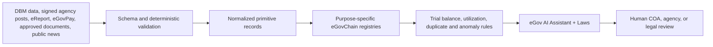

# Tolvaris accountability, analytics, RAG, and OCR

This document describes the implemented normalization and privacy boundaries around the public-project ledger. All bundled records are explicitly synthetic hackathon fixtures; they are not allegations about real people, businesses, agencies, or projects.

## End-to-end data flow



The deterministic layer runs before AI. AI may explain a review signal and suggest potentially relevant law, but it may not declare guilt, corruption, or a legal violation. A citation is accepted only when it refers to retrieved evidence or an official source that a human can verify.

## Normalized registries and disclosure boundaries

| Registry | Normalized records | Public/on-chain | Protected off-chain |
|---|---|---|---|
| `TolvarisGeneralLedger` | Agency → JournalEntry → JournalLine | account code/name/type, debit, credit, project key, date, signer key ID, request digest | private signing key and source credentials |
| `TolvarisBenefitRegistry` | BenefitProgram → EligibilityRecord → NotificationReceipt | program/rules/legal-basis metadata, group/card type codes, pseudonymous commitments, delivery status | citizen name, contact details, raw IDs, message body |
| `TolvarisReportRegistry` | Report → StatusChange → DisclosureDecision; ExternalEvidenceSignal | report/evidence commitments, category, assigned agency, status, review signal/source | reporter and subject identities plus detailed evidence in encrypted, access-controlled storage |
| `TolvarisPaymentProofRegistry` | PaymentProof → StatusChange | commitments for individuals; policy-approved business name/reference/amount/currency for businesses | individual identity, provider payload, bank/payment details |
| `TolvarisDocumentProofRegistry` | DocumentProof | content/normalized digests and approved public-government metadata | scan, OCR text, TIN, taxpayer identity, addresses, individual tax amounts |

The eReport disclosure decision is policy- and legal-basis-driven. A person's status or prominence never automatically makes their identity public. Authorized access to encrypted identities must be time-bounded and audited.

## General-ledger controls and standards basis

Every journal entry is rejected unless total debit equals total credit. Analytics independently recomputes the trial balance and the expanded equation:

```text
Assets = Liabilities + Equity + Revenue − Expense
```

The schema is a prototype, not a claim of formal COA certification. It is aligned conceptually with the Philippine Commission on Audit's [Government Accounting Manual](https://coa.gov.ph/wp-content/uploads/ABC-Help/GAM_A/b1.htm), which covers accounting policies, books, registries, records, reports, financial statements, and illustrative entries under the Philippine Public Sector Accounting Standards. Production account codes must be mapped to COA's applicable [Revised Chart of Accounts](https://coa.gov.ph/wp-content/uploads/wpfd/preview_files/Annex_A-Vol_III_RCA%2864517d8435994992e682b3e4aa0a0661%29.pdf), not the deliberately suffixed `-MOCK` codes in this repository. [IPSASB's financial-statement project](https://www.ipsasb.org/consultations-projects/presentation-financial-statements) identifies accountability, decision usefulness, transparency, understandability, and accessibility as key public-sector reporting goals.

Current deterministic review rules include:

- obligations greater than allotments;
- disbursements greater than obligations;
- disbursements greater than allotments;
- trial-balance difference;
- accounting-equation difference;
- exact/contextual project duplicates.

These are review signals, not findings. The mock dataset intentionally includes anomalies while keeping every journal entry balanced.

## Public-interest news RAG

`runPublicInterestNewsRag` accepts evidence from a bounded `NewsRetriever`, limits evidence to 20 items, and asks eGov AI to normalize only supplied metadata/snippets. It drops model-produced citations whose URL was not retrieved, marks every result `UNVERIFIED_MEDIA_SIGNAL`, and calls Laws only for possible legal context. On-chain storage is limited to source/project/claim digests, public source metadata, and review status.

`runWeeklyAccountabilityRag` adds the scheduled batch layer: it searches only explicit English/Filipino public-integrity keywords, restricts evidence to the seven-day window, deduplicates URL/content-digest pairs, assigns a deterministic normalized category, and emits code-readable JSON plus `HUMAN_REVIEW_REQUIRED` eReport drafts. The scheduled job may automatically publish unverified signal digests to `TolvarisReportRegistry`; it never automatically files an eReport complaint or converts a media allegation into a finding. Full operations and source schema: [weekly public-integrity RAG](weekly-accountability-rag.md).

News is a lead, never proof. Production retrieval must use an approved allowlist, preserve publisher/title/URL/published time/content digest, respect source terms, and require agency/COA/legal validation before any case action.

## Government-document OCR

`normalizeGovernmentDocument` runs Document Extractor, then the Assistant converts the OCR candidate into strict schema version `1.0`. It records extractor, normalizer, and total latency. Missing values must remain missing, uncertainty is placed in `warnings`, and deterministic validation runs before anchoring.

Visibility controls are:

- `PRIVATE_INDIVIDUAL`: no public title or source URL; raw and normalized private fields stay encrypted off-chain.
- `POLICY_GATED_BUSINESS`: the same private default until a disclosure policy explicitly approves selected fields.
- `PUBLIC_GOVERNMENT`: approved document title/source metadata may be public; the original scan and extracted sensitive fields still stay off-chain.

## Reproducible synthetic evidence

```bash
set -a
source .env
source .local/tolvaris-registry.env
set +a

pnpm deploy:mock-government-ledger
pnpm analyze:mock-government-ledger
pnpm deploy:accountability-registries
pnpm kpi:accountability
```

Local deployment receipts and KPI reports are stored under ignored `.local/`; sanitized reusable inputs and analytics are in `data/` and `apps/web/public/data/`.
