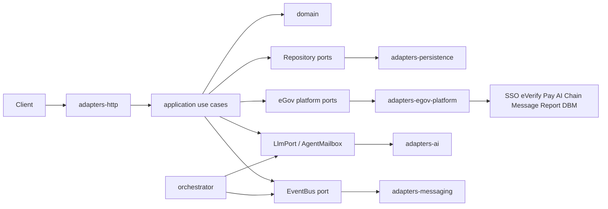

# Architecture

## Purpose

eGov is a modular electronic-government platform. The system is built as a **monorepo** with **hexagonal architecture** (ports and adapters) so domain rules stay independent of databases, HTTP frameworks, AI providers, and message brokers.

A first-class **orchestration layer** coordinates multiple AI agents across the delivery pipeline — from foundation decisions through design, implementation, verification, and production operations.

## System layers

```
┌─────────────────────────────────────────────────────────────┐
│  Apps (composition roots)                                   │
│  api · web · orchestrator                                   │
└───────────────────────────┬─────────────────────────────────┘
                            │ wires
┌───────────────────────────▼─────────────────────────────────┐
│  Adapters (infrastructure)                                  │
│  http · persistence · ai · messaging · egov-platform        │
└───────────────────────────┬─────────────────────────────────┘
                            │ implement
┌───────────────────────────▼─────────────────────────────────┐
│  Application (use cases + ports)                            │
└───────────────────────────┬─────────────────────────────────┘
                            │ uses
┌───────────────────────────▼─────────────────────────────────┐
│  Domain (entities, value objects, domain events)            │
└─────────────────────────────────────────────────────────────┘
         shared ← cross-cutting types (Result, errors, ids)
```

| Layer | Package(s) | Responsibility | May depend on |
|-------|------------|----------------|---------------|
| Domain | `@egov/domain` | Business rules, invariants | nothing external |
| Application | `@egov/application` | Use cases, port interfaces | domain, shared |
| Shared | `@egov/shared` | Result types, errors, ids | nothing domain-specific |
| Adapters | `@egov/adapters-*` | I/O implementations of ports | application ports, shared |
| Apps | `apps/*` | Wire adapters → use cases; expose surfaces | all packages |

## Ports and adapters

**Ports** live in `@egov/application` (`ports/` + `ports/platform.ts`). They describe what the application needs, not how it is done.

### Internal / local ports

| Port | Direction | Role |
|------|-----------|------|
| `CitizenRepository` | outbound | Persist and load citizens / service profiles |
| `ServiceCaseRepository` | outbound | Persist service cases and status history |
| `DocumentStore` | outbound | Store and retrieve case documents |
| `EventBus` | outbound | Publish domain / integration events |
| `LlmPort` | outbound | Call a language model (local/orchestrator; may wrap platform AI later) |
| `AgentMailbox` | outbound | Agent-to-agent message exchange |
| `Clock` | outbound | Time (testable) |

### Official eGov API Platform ports

Credentials: [platforms.e.gov.ph/dashboard](https://platforms.e.gov.ph/dashboard). Catalog: [platform-apis.md](./platform-apis.md).

| Port | Platform service | Base URL |
|------|------------------|----------|
| `EgovSsoPort` | eGov SSO | `https://hackathon-sso.e.gov.ph` |
| `EVerifyPort` | eVerify | `https://hackathon-everify-api.e.gov.ph` |
| `FaceLivenessPort` | Face Liveness | `https://hackathon-face-liveness-api.e.gov.ph` |
| `EMessagePort` | eMessage | `https://ws-message.e.gov.ph` |
| `EgovAiPort` | eGov AI | `https://egov-ai-core-ws.oueg.info` |
| `EgovPayPort` | eGovPay | `https://egovpay-pgi-ws-dev.oueg.info` |
| `EgovChainPort` | eGovChain JSON-RPC | `https://hackathon-blockchain.e.gov.ph` (chain `13371`) |
| `EReportPort` | eReport | `https://stg-ereport-ws.oueg.info` |
| `DbmCompassPort` | DBM Compass | `https://dbm-ws.oueg.info` |

**Adapters** implement those ports:

| Adapter package | Implements |
|-----------------|------------|
| `@egov/adapters-persistence` | repositories, document store (in-memory stub → Postgres later) |
| `@egov/adapters-http` | REST/HTTP inbound adapters |
| `@egov/adapters-ai` | LLM and agent mailbox (Ollama / gateway stubs) |
| `@egov/adapters-messaging` | event bus (in-memory stub → queue later) |
| `@egov/adapters-egov-platform` | all official platform ports via `fetch` + env secrets |

Dependency rule: **adapters depend inward; domain never imports adapters.**

## Apps

### `apps/api`

HTTP composition root. Constructs adapters, injects them into use cases, mounts HTTP routes. This is the primary runtime entry for government service APIs.

### `apps/web`

Citizen / staff UI shell. Talks only to the API (or BFF), never to persistence or AI adapters directly.

### `apps/orchestrator`

Multi-agent runtime. Agents collaborate through the `AgentMailbox` port and shared task board. Stages map to the delivery line:

1. **Foundation** — architecture and boundary decisions  
2. **Design** — domain and interface design  
3. **Build** — implementation proposals and patches  
4. **Verify** — criteria and fallback checks  
5. **Ship** — production readiness and ops notes  

Agents do not own production data paths; they advise and draft through ports so human gates remain authoritative (see `boundaries.md`).

## Data and control flow



## Non-goals (architecture)

- Domain logic inside React components or route handlers  
- Direct DB or LLM or platform URL calls from use cases (always via ports)  
- Inventing fake government APIs when an official platform service exists  
- Cross-package circular imports  
- A single mega-package that mixes UI, domain, and infra  

## Evolution path

1. **Now** — in-memory adapters, platform port stubs with env-backed fetch, orchestrator stubs, foundation docs  
2. **Next** — wire use cases to SSO / eVerify / Pay; harden path maps against live OpenAPI from the dashboard  
3. **Later** — Postgres, queue-backed events, multi-tenant agency isolation  

## Product Vision (target — not yet built)

> Everything in this section is aspirational. It comes from the hackathon pitch doc — [`eGov_PH_SuperApp_System_Architecture.md`](../eGov_PH_SuperApp_System_Architecture.md) — and is included here only to give the long-term direction. Nothing below is implemented unless it is also named in the "Current" sections above with a matching port, adapter, or use case. When in doubt, the sections above this one are ground truth; this section is not.

### Multi-agency PSA cascade

The product goal is zero-redundancy onboarding: a PSA PhilSys update (marriage, name change, death, etc.) propagating automatically across SSS, Pag-IBIG, PhilHealth, DFA, and other linked agency records, with no manual resubmission per agency.

**Status: not built.** `ServiceCase` (`packages/domain/src/index.ts`) has no `agency` field and no cross-agency propagation logic — it is a single-agency case tracker today. This needs real domain modeling (agency-linked cases, a PSA-update domain event, propagation rules) before it can exist. Tracked in [`tasks.md`](./tasks.md) under **Parking lot → Multi-agency tenancy model**; not scheduled into a phase yet.

### BANGON — proactive benefit-matching workflow

BANGON is the flagship product feature: instead of a citizen applying for benefits agency-by-agency, the app scans a verified citizen and proactively finds which benefits they already qualify for. Full flow: `DbmCompassPort` (fund check, runs first and independent of any one citizen — which departments/benefits currently have sufficient funds) → citizen scan-in → `FaceLivenessPort` (live-person check) + `EVerifyPort` (identity match) → benefit-eligibility search (scoped only to the fundable-benefit list from the DBM Compass check) → `EMessagePort` (eligibility notification) → `EgovPayPort` (disbursement, if the benefit is financial) → `EgovChainPort` (anchor the match + transaction). Fund-checking runs before matching, not after, so a citizen is never told they're eligible for something that turns out unfunded. If a matched benefit is never received, the citizen can file via `EReportPort` — the same port/mechanism as the existing eReport usage (Workflow 2 in the pitch doc), not a separate one. `EgovAiPort` (Assistant, Laws & Regulations, Translator) is intended to explain eligibility in plain language after a match is decided — cosmetic/side-effect only, never part of the eligibility decision itself (not wired in yet, see below).

**Status: eligibility-matching core is built; full end-to-end composition and eGov AI narration are not.**

- **Domain** (`packages/domain/src/index.ts`): `Benefit`, `EligibilityRule`, `BenefitMatch`, `CitizenEligibilityProfile` types, plus a pure `isEligibleForBenefit` function. Eligibility fields are restricted to what eVerify/PSA actually returns (date of birth → age, civil status, vital status) — no employment/income/region data, since no platform API provides it.
- **Application** (`packages/application/src/ports/index.ts`): `BenefitCatalogPort`. (`packages/application/src/use-cases/bangon.ts`): `findEligibleBenefits` (fund-check-then-match, fails closed if a fund-check call errors), `notifyEligibility` (eMessage), `disburseBenefit` (eGovPay, rejects non-financial benefits with a `VALIDATION` error), `confirmCitizenIdentity` (eVerify → `CitizenEligibilityProfile`). Each is a small composable function per `docs/design.md`'s use-case pattern — not one monolithic flow — matching `orchestration.ts`'s style.
- **Adapter** (`packages/adapters-persistence/src/index.ts`): `createInMemoryBenefitCatalog`, seeded with 3 hardcoded benefits (SSS senior pension, PhilHealth senior subsidy, DSWD widowed assistance), each declaring its own DBM dataset + query for the fund-check. This hardcoded list is a deliberate hackathon simplification — no live agency benefit-catalog API exists among the 9 platform services.
- **Not yet built:** no `apps/api` HTTP route composes these into one callable flow (deferred until a client needs it — Android, per current direction); Face Liveness gating is not wired into `confirmCitizenIdentity` (the caller is expected to check `isFaceLivenessPassed` before calling it, not yet enforced in code); `EgovChainPort` anchoring of a match/transaction is not wired in; `EgovAiPort` plain-language narration is not wired in; `EReportPort` non-delivery complaint path reuses the existing eReport port but has no BANGON-specific trigger yet.
- Verified by a manual script exercising `findEligibleBenefits`/`disburseBenefit`/`notifyEligibility` against fake ports (fund-check gating, non-financial guard, and adapter-failure propagation all confirmed correct) — no repo-wide test framework exists yet (`docs/tasks.md` Phase 0: "Add root `test` suite beyond platform smoke" still unchecked), so this is not a committed automated test.

See [`tasks.md`](./tasks.md) **Phase 1 — Core domain vertical** for where the remaining composition/wiring work is tracked.

### High-scale target (100M+ transactions/week)

Long-term design target, not current capacity — the platform endpoints in use (e.g. `hackathon-blockchain.e.gov.ph`) are hackathon-sandbox infrastructure with no published SLA. The hexagonal layering above means this is a swap-in later, not a rewrite: batched eGovChain anchors, a queue-backed `EventBus` (see **Phase 3 — Durable infrastructure** in [`tasks.md`](./tasks.md)), and a Postgres-backed repository replacing the in-memory stub. None of this is required for, or built into, the hackathon scope.

### Nationwide rollout (barangay → national)

Vision: the same SSO login and eGov Pay integration extending from barangay clearance offices up to national agency services, giving citizens one unified transaction history end to end. **Status: not built** — no barangay-specific code, config, or routing exists; this is narrative scope from the pitch doc only.

---

See also: [platform-apis.md](./platform-apis.md), [design.md](./design.md), [boundaries.md](./boundaries.md), [fallback.md](./fallback.md).
