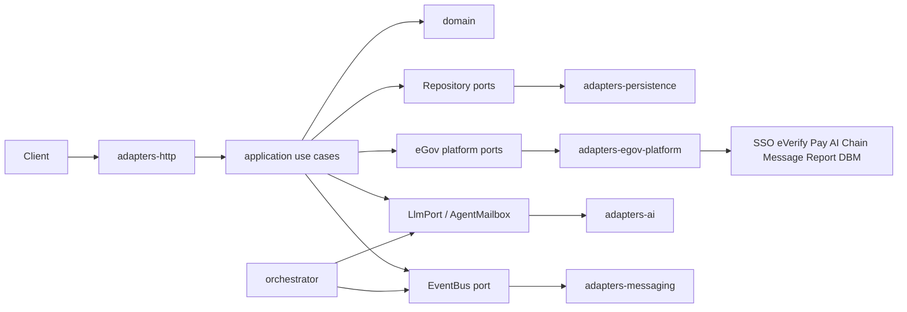

# Architecture

## Purpose

eGov is a modular electronic-government platform. The system is built as a **monorepo** with **hexagonal architecture** (ports and adapters) so domain rules stay independent of databases, HTTP frameworks, AI providers, and message brokers.

A first-class **orchestration layer** coordinates multiple AI agents across the delivery pipeline — from foundation decisions through design, implementation, verification, and production operations.

## System layers

```
┌─────────────────────────────────────────────────────────────┐
│  Apps (composition roots)                                   │
│  api · web · orchestrator                                   │
└───────────────────────────┬─────────────────────────────────┘
                            │ wires
┌───────────────────────────▼─────────────────────────────────┐
│  Adapters (infrastructure)                                  │
│  http · persistence · ai · messaging · egov-platform        │
└───────────────────────────┬─────────────────────────────────┘
                            │ implement
┌───────────────────────────▼─────────────────────────────────┐
│  Application (use cases + ports)                            │
└───────────────────────────┬─────────────────────────────────┘
                            │ uses
┌───────────────────────────▼─────────────────────────────────┐
│  Domain (entities, value objects, domain events)            │
└─────────────────────────────────────────────────────────────┘
         shared ← cross-cutting types (Result, errors, ids)
```

| Layer | Package(s) | Responsibility | May depend on |
|-------|------------|----------------|---------------|
| Domain | `@egov/domain` | Business rules, invariants | nothing external |
| Application | `@egov/application` | Use cases, port interfaces | domain, shared |
| Shared | `@egov/shared` | Result types, errors, ids | nothing domain-specific |
| Adapters | `@egov/adapters-*` | I/O implementations of ports | application ports, shared |
| Apps | `apps/*` | Wire adapters → use cases; expose surfaces | all packages |

## Ports and adapters

**Ports** live in `@egov/application` (`ports/` + `ports/platform.ts`). They describe what the application needs, not how it is done.

### Internal / local ports

| Port | Direction | Role |
|------|-----------|------|
| `CitizenRepository` | outbound | Persist and load citizens / service profiles |
| `ServiceCaseRepository` | outbound | Persist service cases and status history |
| `DocumentStore` | outbound | Store and retrieve case documents |
| `EventBus` | outbound | Publish domain / integration events |
| `LlmPort` | outbound | Call a language model (local/orchestrator; may wrap platform AI later) |
| `AgentMailbox` | outbound | Agent-to-agent message exchange |
| `Clock` | outbound | Time (testable) |

### Official eGov API Platform ports

Credentials: [platforms.e.gov.ph/dashboard](https://platforms.e.gov.ph/dashboard). Catalog: [platform-apis.md](./platform-apis.md).

| Port | Platform service | Base URL |
|------|------------------|----------|
| `EgovSsoPort` | eGov SSO | `https://hackathon-sso.e.gov.ph` |
| `EVerifyPort` | eVerify | `https://hackathon-everify-api.e.gov.ph` |
| `FaceLivenessPort` | Face Liveness | `https://hackathon-face-liveness-api.e.gov.ph` |
| `EMessagePort` | eMessage | `https://ws-message.e.gov.ph` |
| `EgovAiPort` | eGov AI | `https://egov-ai-core-ws.oueg.info` |
| `EgovPayPort` | eGovPay | `https://egovpay-pgi-ws-dev.oueg.info` |
| `EgovChainPort` | eGovChain JSON-RPC | `https://hackathon-blockchain.e.gov.ph` (chain `13371`) |
| `EReportPort` | eReport | `https://stg-ereport-ws.oueg.info` |
| `DbmCompassPort` | DBM Compass | `https://dbm-ws.oueg.info` |

**Adapters** implement those ports:

| Adapter package | Implements |
|-----------------|------------|
| `@egov/adapters-persistence` | repositories, document store (in-memory stub → Postgres later) |
| `@egov/adapters-http` | REST/HTTP inbound adapters |
| `@egov/adapters-ai` | LLM and agent mailbox (Ollama / gateway stubs) |
| `@egov/adapters-messaging` | event bus (in-memory stub → queue later) |
| `@egov/adapters-egov-platform` | all official platform ports via `fetch` + env secrets |

Dependency rule: **adapters depend inward; domain never imports adapters.**

## Apps

### `apps/api`

HTTP composition root. Constructs adapters, injects them into use cases, mounts HTTP routes. This is the primary runtime entry for government service APIs.

### `apps/web`

Citizen / staff UI shell. Talks only to the API (or BFF), never to persistence or AI adapters directly.

### `apps/orchestrator`

Multi-agent runtime. Agents collaborate through the `AgentMailbox` port and shared task board. Stages map to the delivery line:

1. **Foundation** — architecture and boundary decisions  
2. **Design** — domain and interface design  
3. **Build** — implementation proposals and patches  
4. **Verify** — criteria and fallback checks  
5. **Ship** — production readiness and ops notes  

Agents do not own production data paths; they advise and draft through ports so human gates remain authoritative (see `boundaries.md`).

## Data and control flow



## Non-goals (architecture)

- Domain logic inside React components or route handlers  
- Direct DB or LLM or platform URL calls from use cases (always via ports)  
- Inventing fake government APIs when an official platform service exists  
- Cross-package circular imports  
- A single mega-package that mixes UI, domain, and infra  

## Evolution path

1. **Now** — in-memory adapters, platform port stubs with env-backed fetch, orchestrator stubs, foundation docs  
2. **Next** — wire use cases to SSO / eVerify / Pay; harden path maps against live OpenAPI from the dashboard  
3. **Later** — Postgres, queue-backed events, multi-tenant agency isolation  

See also: [platform-apis.md](./platform-apis.md), [design.md](./design.md), [boundaries.md](./boundaries.md), [fallback.md](./fallback.md).
