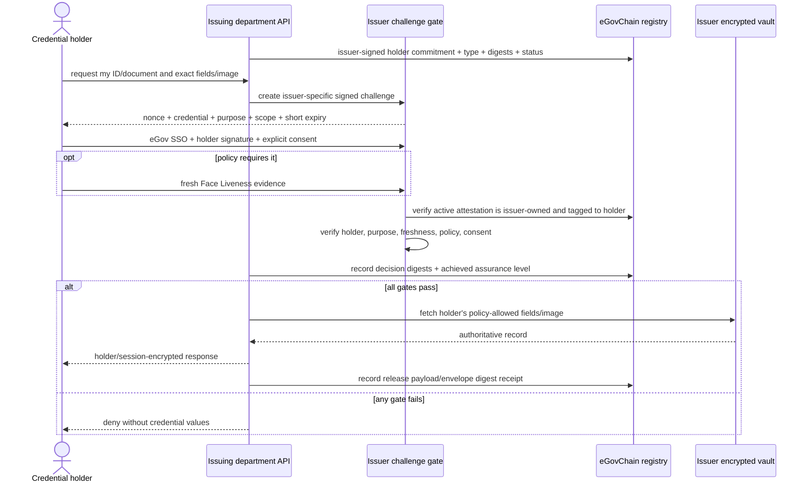
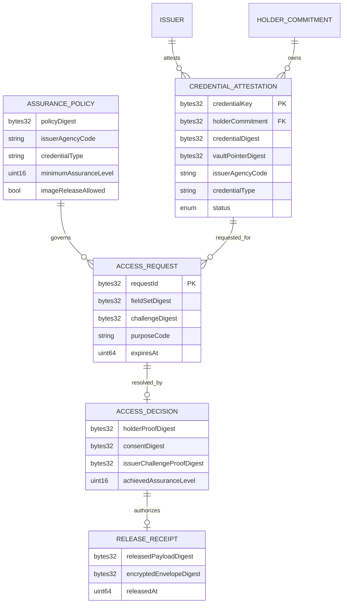

# Government credential and document self-service retrieval

Tolvaris treats the blockchain as a tamper-evident source of truth that a pseudonymous holder has a valid credential issued by a specific department. It is **not a shared government data silo and not a source of document contents**. The holder requests an ID or legal document directly from its issuing department; only that department reads its own vault and returns the record directly to the authenticated holder.

## What is on-chain and off-chain

| On eGovChain | Issuer's encrypted off-chain vault |
|---|---|
| pseudonymous holder commitment | name and contact details |
| plaintext credential/document type | card/document number and fields |
| issuer agency code | ID/document image and portrait |
| credential and vault-pointer digests | biometrics and liveness capture |
| active/revoked/expired status | decryptable object-storage/database pointer |
| issuer policy digest | provider response and source record |
| challenge/request/consent/proof digests | consent and authorization evidence |
| release receipt digest and timestamp | holder/session-encrypted response and key material |

Encryption does not make public immutable data permanently private. Actual values and images therefore never belong on the public chain. A digest proves that the released object matches the attested object without exposing its contents.

## Challenge and release sequence

No result is described as “100% certain.” The system produces a **high-assurance decision** from independently verified factors and fails closed when any required factor is missing, stale, revoked, mismatched, or below threshold.

## Department-specific challenges

Each issuing department owns an approved, versioned policy. The challenge is not a security question based on personal trivia; it is a signed, single-use cryptographic challenge bound to the issuer, authenticated holder commitment, credential, purpose, requested fields, nonce, and short expiry.

Illustrative policies in `DEPARTMENT_CHALLENGE_POLICY_EXAMPLES` are deliberately not production policy:

| Issuer API | Credential | Illustrative difference |
|---|---|---|
| BIR | TIN ID / tax registration | tax-specific purpose and minimal registration fields; image disabled by default |
| LTO | Driver licence | licence class/expiry/restrictions; higher liveness threshold; image may be returned only when requested, allowed, and explicitly consented |
| SSS | SSS credential | membership/coverage scope; image disabled by default |

The issuer remains authoritative. An LTO attestation can only authorize LTO to return that holder's LTO record; it does not let BIR, SSS, Tolvaris, or another agency retrieve it. A blockchain attestation never forces disclosure. Release additionally requires the issuer's approved API contract, authenticated holder, lawful purpose, data-minimization policy, applicable consent, and audited access controls.

## Generic normalized schema

Implementation: [`contracts/TolvarisCredentialExchangeRegistry.sol`](../contracts/TolvarisCredentialExchangeRegistry.sol) and [`packages/application/src/use-cases/credential-access.ts`](../packages/application/src/use-cases/credential-access.ts).
