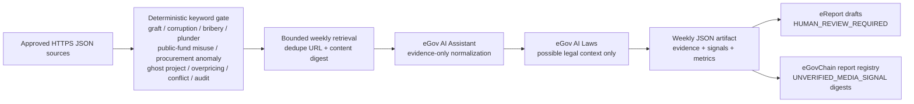

# Weekly public-integrity RAG pipeline

The weekly job retrieves approved public-interest evidence, applies an explicit graft/corruption keyword policy before any AI call, asks eGov AI to normalize only the retrieved evidence, emits machine-readable JSON, creates **review-gated eReport drafts**, and optionally anchors `UNVERIFIED_MEDIA_SIGNAL` digests in `TolvarisReportRegistry`.

It does not automatically accuse a person, determine guilt, declare a legal violation, or file an official eReport complaint. A human reviewer must approve a draft before any later eReport submission workflow.

## Weekly flow



## Keyword scope

The built-in groups include English and Filipino terms for:

- graft and `katiwalian`;
- corruption and `korapsyon`;
- bribery, kickbacks, `suhol`, and `lagay`;
- plunder and `pandarambong`;
- misuse, misappropriation, or theft of public funds, including `pagnanakaw sa bayan`;
- procurement fraud, bid rigging, and anomalous contracts;
- ghost projects/deliveries;
- overpricing;
- conflicts of interest and nepotism; and
- audit findings/anomalies.

A keyword match is only a retrieval condition. Every normalized record remains an unverified review signal.

## Source contract

Configure `ACCOUNTABILITY_RAG_SOURCE_URLS_JSON` as a JSON array of approved HTTPS endpoints. Each endpoint must return either an array or `{ "items": [] }` whose items contain:

```json
{
  "source": "Publisher name",
  "title": "Source title",
  "url": "https://approved.example/item",
  "publishedAt": "2026-07-22T00:00:00.000Z",
  "snippet": "Short evidence-grounded snippet"
}
```

Production must set `ACCOUNTABILITY_RAG_ALLOWED_DOMAINS`. An optional common Bearer token may be supplied through `ACCOUNTABILITY_RAG_SOURCE_BEARER`. Local runs can instead set `ACCOUNTABILITY_RAG_EVIDENCE_FILE` to a repo-relative JSON file; a synthetic example is provided in [`data/weekly-accountability-evidence.sample.json`](../data/weekly-accountability-evidence.sample.json).

## Output contract

The job writes private mode-`0600` files to:

- `.local/reports/weekly-accountability-YYYY-MM-DD.json`; and
- `.local/reports/weekly-accountability-rag-latest.json`.

The JSON contains the run period, exact keyword policy, deduplicated evidence, normalized signals, matched keywords, deterministic categories, eReport drafts, Laws context, timing metrics, and blockchain receipts. Prompts, AI tokens, signing keys, and eReport complainant identities are excluded.

## Run and schedule

Dry run—AI normalization and JSON only:

```bash
ACCOUNTABILITY_RAG_EVIDENCE_FILE=data/weekly-accountability-evidence.sample.json \
ACCOUNTABILITY_RAG_ALLOWED_DOMAINS=example.com \
pnpm weekly:accountability-rag
```

Publish signal digests after configuring the deployed registry and signer:

```bash
pnpm weekly:accountability-rag -- --publish-chain
```

The GitHub workflow [`.github/workflows/weekly-accountability-rag.yml`](../.github/workflows/weekly-accountability-rag.yml) is scheduled every Monday at 09:00 Asia/Manila. It becomes operational only after its repository secrets and variables are configured. The job uploads the weekly JSON as a private workflow artifact; it does not commit generated news/report data to Git.
